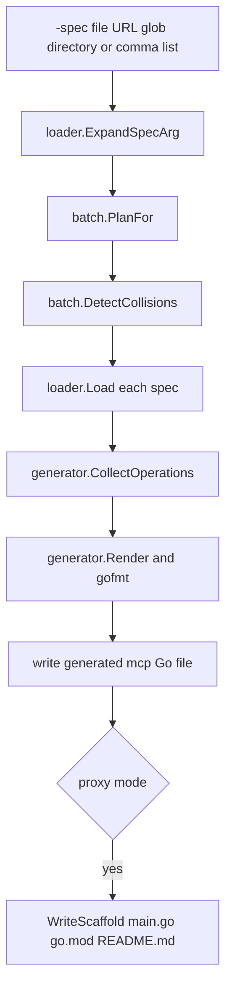

# Generator architecture

The CLI orchestrates a per-spec pipeline. `pkg/loader` normalizes input into kin-openapi's `*openapi3.T`; `pkg/generator` collects included operations and renders Go; `pkg/batch` only derives per-spec options and prevents output collisions. This separation keeps batch behavior outside the single-document generator core.

This shows the CLI generation path. In batch mode, planning and generation are repeated per resolved spec after collision detection.

## Inputs and normalization

`loader.Load` accepts local paths and HTTP(S) URLs. It validates every loaded document. Swagger 2.0 is identified from its top-level marker and converted with `kin-openapi/openapi2conv`; other documents are loaded as OpenAPI 3.x. Local OpenAPI documents are loaded with an absolute file location so relative external references resolve from the spec directory.

The loader bounds URL response size with `DefaultMaxSpecSize` (32 MiB) and supplies a 30-second fetch timeout when the caller context lacks a deadline. `WriteV3YAMLJSONOnly`, used by `-emit-v3`, writes a cloned v3 representation with non-JSON response content types removed; it does not mutate the loaded document.

## Operation collection and schema output

The generator walks paths and methods in sorted order. An included operation becomes an MCP tool with an input schema that groups path, query, header, and body arguments. Per-operation schema conversion produces self-contained `$defs`, including recursion-safe handling of shared components. The shared component pointer-to-name lookup is reused during one collection run, but definitions are not shared across tools or specs.

The default schema is draft-07-compatible. `-openai-compat` uses a narrower form: references are inlined, `oneOf` and `anyOf` select their first branch, `allOf` is shallow-merged, and objects receive `additionalProperties: false`.

Generated companion handlers decode arguments, call the corresponding `oapi-codegen` `<Operation>WithResponse` method, and transform the HTTP response into a runtime result. Proxy handlers instead construct and send `*http.Request` values directly.

## Emission modes

| Concern | Companion | Proxy |
|---|---|---|
| Required configuration | `-client-import` | `-module` |
| Generated artifact | One `<pkg>.mcp.go` | Module root scaffold plus `<pkg>/<pkg>.mcp.go` |
| Upstream client | User-provided `oapi-codegen` client | Runtime HTTP helpers and configured HTTP client |
| Authentication | Application responsibility | Derived from OpenAPI security schemes and configured through generated scaffold/runtime |
| MCP SDK selection | Application import | `-sdk=gosdk` or `-sdk=mark3labs` scaffold choice |

Generation formats source through `gofmt`. The companion output is protected by a golden test, making its byte-level format a deliberate compatibility surface.

## Batch planning

A `-spec` value may resolve to one or many references. Multi-spec mode derives each package name as `<filename-slug>mcp`, writes it under `<out>/<filename-slug>mcp`, and appends the slug to either the companion import base or proxy module base. A slug consists only of lowercase letters and digits and cannot begin with a digit. Duplicate slugs stop the run before writes occur. Individual generation failures are accumulated so a batch run can report all failing specs; the CLI returns generation exit code `3` when any plan fails.
