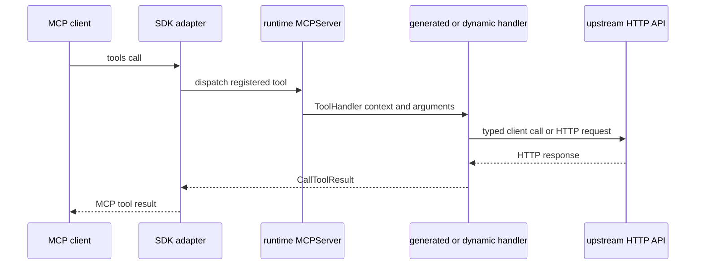

# MCP runtime and dynamic registration

`pkg/runtime` is the generated code's stable, MCP-library-agnostic surface. Generated packages register `runtime.Tool` values through:

```go
type MCPServer interface {
    AddTool(tool Tool, handler ToolHandler)
}
```

The `gosdk` and `mark3labs` adapter packages translate this representation into their respective MCP library APIs. Generated code therefore does not directly depend on either MCP SDK.



This shows the shared execution shape for generated and dynamically registered tools.

## Tool results

`CallToolResult` preserves tool-level failure separately from protocol errors. Handler errors are reserved for protocol failures; HTTP and validation failures are represented as results with `IsError` set.

For an upstream response, `NewToolResultFromHTTP` retains the status and a curated header set:

- Successful JSON responses become both text and structured JSON.
- Successful image and audio responses use native MCP content blocks through adapters.
- Other successful binary content becomes an embedded resource identified by a content-addressed `urn:openapi-go-mcp:response:sha256:...` URI, not an upstream location.
- Non-2xx responses become error results with a `{status, headers, body}` structured envelope.

## Registration options

`runtime.Config` is built from options and applied per registered tool. Relevant options include:

- `WithNamePrefix` namespaces tools at registration time.
- `WithExtraProperties` augments each input schema and places decoded values in the request context.
- `WithHTTPClient`, `WithRequestTimeout`, and `WithMaxResponseBytes` control outbound behavior where the handler uses them.
- `WithMTLSHTTPClient` explicitly signals client-certificate configuration for mutual TLS requirements.
- `WithAllowInsecureAuth` permits credential-bearing HTTP calls only for isolated local development; the default is HTTPS-oriented.
- `WithServerVariables` substitutes OpenAPI server URL variables.
- `WithRequestAuthProvider` supplies deployment-specific signing for custom or OpenID Connect-style schemes.

## Dynamic registration

`pkg/dynamic.Register` uses the same operation collector and proxy request semantics without writing Go source. It is designed for startup-time registration from deployment-owned, trusted configuration—not arbitrary end-user input.

For a local spec, it delegates to `loader.Load`. A remote source must be an absolute HTTPS URL with no credentials or fragment. The dynamic loader disables redirects, limits source size, rejects external references, and requires `Config.BaseURL` for remote documents so a remotely retrieved document cannot choose an arbitrary upstream target. It uses separate source and upstream HTTP clients to avoid applying a private-API transport to document retrieval.

After loading, it resolves the base URL and server variables, prepares validators, wraps the upstream client to prevent redirects, and registers every collected proxy-mode operation. Remote documents declaring OAuth client-credentials token URLs are rejected. Dynamic registration occurs before serving tools, so parsing and validator preparation are not on the request path.
